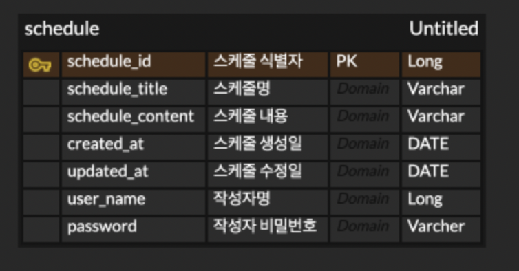

# 📅 Scheduler API 문서

---

## 📌 ERD



---

## 📘 API 명세서 요약

| No | Method | Description     | URL                           | Request      | Response           |
|----|--------|------------------|--------------------------------|--------------|--------------------|
| [1](#1-일정-생성)  | POST   | 일정 생성        | /api/schedule                  | RequestBody          | 200 OK |
| [2](#2-전체-일정-조회) | GET    | 전체 일정 조회   | /api/schedules                 | RequestParam | 200 OK    |
| [3](#3-선택-일정-조회) | GET    | 선택 일정 조회   | /api/schedule/{scheduleId}    | PathVariable | 200 OK             |

---

## 🔽 상세 API 설명

### 1. 일정 생성
- **URL** : `/api/schedule`
- **Method** : `POST`
### 1-1. Request
- **Request Body**
```json
{
  "schedule_title": "schedule title",
  "schedule_content": "schedule content",
  "user_name": "lee",
  "password": "1234"
}
```
---
### 1-2. Response
- **Request Body**
- **desc**
    - 생성한 스케줄 식별자
```json
4
```
---
### 2. 전체 일정 조회
- **URL** : `/api/schedules`
- **Method** : `GET`
### 1-1. Request
- **Request Param**
    - **URL 예시** : `/api/schedules?userName=lee&date=2025-05-08`
    - **필수 여부** : `userName` - `required=true`, `date` - `required=false`
---
### 1-2. Response
- **Request Body**
- **desc**
    - 조건에 맞는 조회(전체)
```json
[
  {
    "schedule_id": 1,
    "schedule_title": "title1",
    "schedule_content": "content1",
    "user_name": "lee",
    "created_at": "2025-05-08T14:00:00",
    "updated_at": "2025-05-08T14:00:00"
  },
  {
    "schedule_id": 2,
    "schedule_title": "title2",
    "schedule_content": "content2",
    "user_name": "lee",
    "created_at": "2025-05-08T14:00:00",
    "updated_at": "2025-05-08T14:00:00"
  }
]
```
---
### 3. 선택 일정 조회
- **URL** : `/api/schedule/{scheduleId}`
- **Method** : `GET`
### 1-1. Request
- **PathVariable**
    - **URL 예시** : `/api/schedule/2`
---
### 1-2. Response
- **Request Body**
- **desc**
    - 식별자에 맞는 조회
```json

  {
    "schedule_id": 1,
    "schedule_title": "title",
    "schedule_content": "content",
    "user_name": "lee",
    "created_at": "2025-05-08T14:00:00",
    "updated_at": "2025-05-08T14:00:00"
  }

```
---
