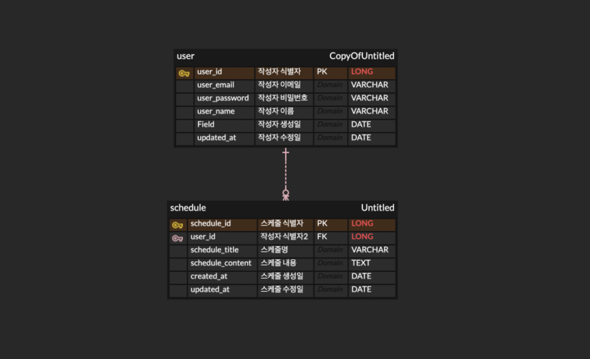

# 📅 Scheduler API 문서

---

## 📌 목적 
간단한 일정 관리 API를 통해 RESTful 서비스를 설계하고 JDBC 사용법 및 Spring 학습

## 🎯 레벨 
- ✅ **LV0** ➡️ API명세서, ERD, SQL 작성️
- ✅ **LV1** ➡️ 일정 생성, 조회 기능 구현
- ✅ **LV2** ➡️ 일정 수정, 삭제 기능 구현
- ✅ **LV3** ➡️ 연관 관계 설정 (작성자, 일정)
- ✅ **LV4** ➡️ 페이지네이션 기능 구현
- ✅ **LV5** ➡️ 예외발생 처리
- ✅ **LV6** ➡️ null 체크 및 검증 수행

## 📁 패키지 구조
```json
com.hyun.scheduler
├── controller // API 진입 지점
├── service // 비즈니스 로직
├── domain 
│ └── dto // 요청 및 응답 객체
│ └── model // 특정 DTO 구현체에서 필요한 인터페이스
├── repository // DB 접근 
├── enums // 에러 코드 Enum 
│ └── model // 공통 에러 인터페이스
│ └── utils // enum에서 공통적으로 사용하는 유틸 메서드
├── exception // 커스텀 예외 처리
└── SchedulerApplication.java // 메인 
```

## 🖥 사용 기술
 - 🛠 **java 17**
 - 🛠 **springboot 3.4**
 - 🛠 **lombok 1.18**
 - 🛠 **mysql connector 8**
 - 🛠 **jdbc**

## 📌 ERD


---

## 📘 API 명세서 요약

| No                | Method | Description | URL                        | Request      | Response |
|-------------------|--------|-------------|----------------------------|--------------|----------|
| [1](#1-일정-생성)     | POST   | 일정 생성       | /api/schedule              | RequestBody          | 200 OK   |
| [2](#2-전체-일정-조회)  | GET    | 전체 일정 조회    | /api/schedules             | RequestParam | 200 OK   |
| [3](#3-선택-일정-조회)  | GET    | 선택 일정 조회    | /api/schedule/{scheduleId} | PathVariable | 200 OK   |
| [4](#4-선택-일정-수정)  | PUT    | 선택 일정 수정    | /api/schedule/update       | RequestBody | 200 OK   |
| [5](#5-선택-일정-삭제)  | POST   | 선택 일정 삭제    | /api/schedule/delete       | RequestBody | 200 OK   |
| [6](#6-페이지네이션-조회) | GET    | 페이지네이션 조회   | /api/page/schedules              | RequestBody | 200 OK   |

---

## 🔽 상세 API 설명

### 1. 일정 생성
- **URL** : `/api/schedule`
- **Method** : `POST`
### 1-1. Request
- **Request Body**
```json
{
  "scheduleTitle": "schedule title",
  "scheduleContent": "schedule content",
  "userName": "lee",
  "userEmail": "meta212121@naver.com",
  "userPassword": "1234"
}
```
---
### 1-2. Response
- **Request Body**
```json
{
  "userId" : 1,
  "scheduleId" : 1
}
```
---
### 2. 전체 일정 조회
- **URL** : `/api/schedules`
- **Method** : `GET`
### 2-1. Request
- **Request Param**
    - **URL 예시** : `/api/schedules?userId=1&date=2025-05-08`
    - **필수 여부** : `userId` - `required=true`, `date` - `required=false`
---
### 2-2. Response
- **Response Body**
- **desc**
    - 조건에 맞는 조회(전체)
```json
[
  {
    "scheduleId": 1,
    "scheduleTitle": "title1",
    "scheduleContent": "content1",
    "userName": "lee",
    "createdAt": "2025-05-08T14:00:00",
    "updatedAt": "2025-05-08T14:00:00"
  },
  {
    "scheduleId": 2,
    "scheduleTitle": "title2",
    "scheduleContent": "content2",
    "userName": "lee",
    "createdAt": "2025-05-08T14:00:00",
    "updatedAt": "2025-05-08T14:00:00"
  }
]
```
---
### 3. 선택 일정 조회
- **URL** : `/api/schedule/{scheduleId}`
- **Method** : `GET`
### 3-1. Request
- **PathVariable**
    - **URL 예시** : `/api/schedule/2`
---
### 3-2. Response
- **Response Body**
- **desc**
    - 식별자에 맞는 조회
```json

  {
    "scheduleId": 1,
    "scheduleTitle": "title",
    "scheduleContent": "content",
    "userName": "lee",
    "createdAt": "2025-05-08T14:00:00",
    "updatedAt": "2025-05-08T14:00:00"
  }

```
---
### 4. 선택 일정 수정
- **URL** : `/api/schedule/update`
- **Method** : `PUT`
### 4-1. Request
- **RequestBody**
```json
{
  "scheduleId": 1,
  "userPassword": "12345",
  "scheduleTitle" : "수정한 제목",
  "scheduleContent" : "수정한 내용",
  "userName" : "수정한 작성자명",
  "userId" : 1
}
```
### 4-2. Response
- **Response Body**
```json
  {
    "scheduleId": 1,
    "scheduleTitle": "title",
    "scheduleContent": "content",
    "userName": "lee",
    "createdAt": "2025-05-08T14:00:00",
    "updatedAt": "2025-05-08T14:00:00"
  }

```
---
### 5. 선택 일정 삭제
- **URL** : `/api/schedule/delete`
- **Method** : `POST`
### 5-1. Request
- **RequestBody**
```json
{
  "userId": 1,
  "scheduleId": 1,
  "userPassword": "12345"
}
```
### 6. 페이지네이션 조회
- **URL** : `/api/page/schedules`
- **Method** : `GET`
### 6-1. Request
- **Request Param**
  - **URL 예시** : `/api/page/schedules?page=0&size=10`
  - **필수 여부** : `page` - `required=false`, `size` - `required=false`
---
### 6-2. Response
- **Response Body**
- **desc**
  - 페이지네이션 조회
  - page default value - 0, size default value - 10
  - 수정일 기준 내림차순 정렬
```json
[
  {
    "scheduleId": 19,
    "scheduleTitle": "Test 21 11Title",
    "scheduleContent": "Test 2 Content",
    "userName": "이의현",
    "createdAt": "2025-05-09T17:10:41",
    "updatedAt": "2025-05-09T17:10:41"
  },
  {
    "scheduleId": 20,
    "scheduleTitle": "title2",
    "scheduleContent": "content2",
    "userName": "lee",
    "createdAt": "2025-05-08T14:00:00",
    "updatedAt": "2025-05-08T14:00:00"
  }
]
```
---